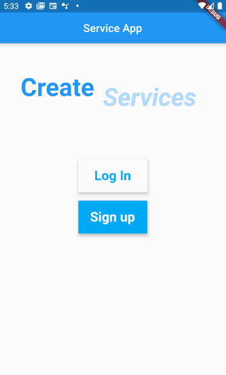
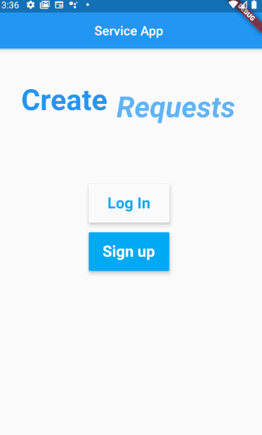
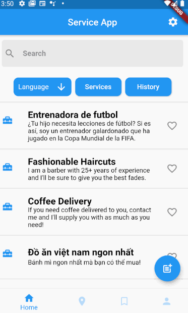

# Service App

## Description
Our app gives our community a way to provide or request services from others. If you have a skill or service you want to provide such as tutoring, plumbing, etc, you can create a Service Listing in our app for everyone else to see. On the other hand, if you are in need of these services, you can create a Request Listing which will also allow your post to be seen by our entire community. Within the app, we also offer built in features aimed towards our diverse community such as a language filter that can be used to sort the listings based on preferred language. This allows users, especially non-native English speaker to easily find listings to fit their needs. Additionally, we've incorporated a rating system where users can rate each other after receiving the services.

## Project Video

## Demo
### Sign Up/Login Page

### Signing Up + Logging In

### Create Listing

### Service/Request Listings

### Other Functionality
#### Bookmark Page, Nearby Page, Profile Page, and Settings

